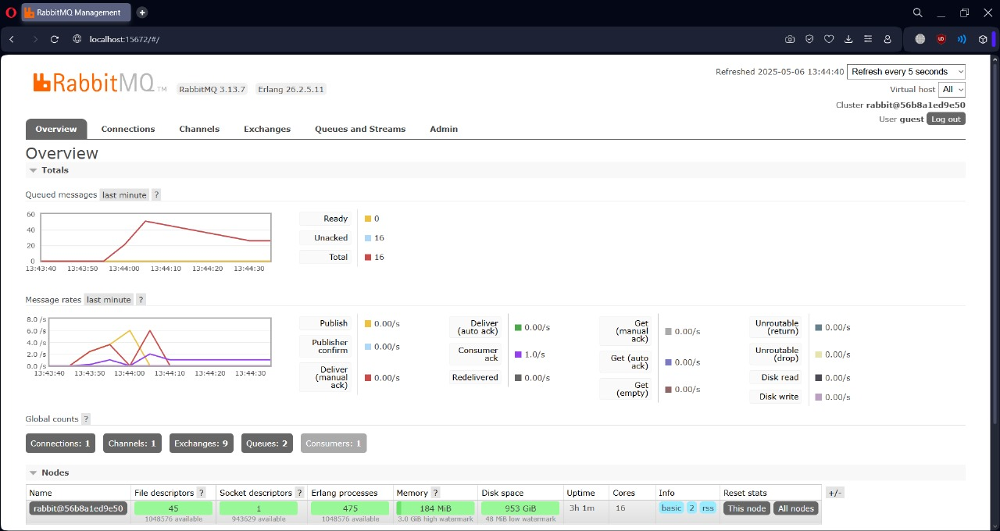

# Module 9 Reflection

## Abhiseka Susanto - 2306244942, Class A

### *a. What is amqp?*

AMQP, or Advanced Message Queuing Protocol, is an application layer protocol used for exchanging messages between applications or systems. It enables different systems to communicate with each other in a more reliable, secure, and asynchronous manner. AMQP is commonly used in distributed systems, cloud computing environments, and message-oriented middleware implementations. It offers features such as message queuing, routing, reliability, and security, making it a popular choice for building more scalable and robust messaging systems.

---

### *b. What does it mean? guest:guest@localhost:5672 , what is the first guest, and what is the second guest, and what is localhost:5672 is for?*

The string guest:guest@localhost:5672 is a URI used to connect an application to RabbitMQ using the AMQP protocol. The first guest refers to the username used for authentication, the second guest is the corresponding password for that username, and localhost:5672 specifies the host and port of the RabbitMQ server being accessed locally.

### Screenshot of slow subscriber simulation

In my screenshot, there are around 50 queued messages. I estimate this happened because I ran the publisher code 12 times, which resulted in 12 × 5 = 60 messages. The first 10 messages could be processed directly by the subscriber, but the remaining 50 had to be queued because there's a part in the subscriber code that causes the thread to sleep. As a result, each process must wait for the sleep to finish before it can proceed. Since the messages piled up, they were stored in the queue while waiting for the subscriber to be ready to process them.